# 📊 BIỂU ĐỒ USE CASE - DỰ ÁN QUẢN LÝ KHÁCH SẠN

**Ngày tạo:** 28 Tháng 1 Năm 2026  
**Phiên bản:** 1.0

---

## 🎯 TỔNG QUAN USE CASE

```mermaid
graph TB
    User["👤 User/Guest"]
    Admin["🎛️ Admin"]
    System["🔌 System/API"]
    
    User -->|Tương tác| UC1["📝 Đăng Ký"]
    User -->|Tương tác| UC2["🔐 Đăng Nhập"]
    User -->|Tương tác| UC3["🔍 Tìm Kiếm Khách Sạn"]
    User -->|Tương tác| UC4["🏨 Xem Chi Tiết Khách Sạn"]
    User -->|Tương tác| UC5["📅 Đặt Phòng"]
    User -->|Tương tác| UC6["💳 Thanh Toán"]
    User -->|Tương tác| UC7["⭐ Đánh Giá & Comment"]
    User -->|Tương tác| UC8["❤️ Quản Lý Yêu Thích"]
    User -->|Tương tác| UC9["📋 Xem Đặt Phòng Của Tôi"]
    User -->|Tương tác| UC10["👤 Quản Lý Tài Khoản"]
    User -->|Tương tác| UC11["🚪 Hủy Đặt Phòng"]
    
    Admin -->|Tương tác| AC1["🏨 Quản Lý Khách Sạn"]
    Admin -->|Tương tác| AC2["🚪 Quản Lý Phòng"]
    Admin -->|Tương tác| AC3["👥 Quản Lý Người Dùng"]
    Admin -->|Tương tác| AC4["⭐ Quản Lý Đánh Giá"]
    Admin -->|Tương tác| AC5["📅 Quản Lý Đặt Phòng"]
    Admin -->|Tương tác| AC6["📊 Xem Thống Kê"]
    
    UC1 -->|Kích hoạt| System
    UC2 -->|Kích hoạt| System
    UC3 -->|Kích hoạt| System
    UC5 -->|Kích hoạt| System
    AC1 -->|Kích hoạt| System
    AC2 -->|Kích hoạt| System
    AC3 -->|Kích hoạt| System
    
    style User fill:#e1f5ff
    style Admin fill:#fff3e0
    style System fill:#f3e5f5
```



---

## 📋 CHI TIẾT USE CASE - ACTOR: USER/GUEST

### 1️⃣ Đăng Ký (Register)
```
Use Case ID: UC-01
Tên: Đăng Ký Tài Khoản
Actor Chính: Guest (Chưa đăng nhập)
Precondition: Guest chưa có tài khoản
Postcondition: Tài khoản được tạo, email xác nhận được gửi

Flow Chính:
  1. Guest nhấp nút "Đăng Ký"
  2. Hệ thống hiển thị form đăng ký (username, email, password)
  3. Guest nhập thông tin
  4. Guest nhấp "Đăng Ký"
  5. Hệ thống xác thực dữ liệu
  6. Hệ thống hash mật khẩu
  7. Hệ thống lưu tài khoản vào database
  8. Hệ thống gửi email xác nhận
  9. Hệ thống chuyển hướng đến trang đăng nhập

Alternative Flows:
  - Email đã tồn tại → Hiển thị lỗi
  - Username đã tồn tại → Hiển thị lỗi
  - Password yếu → Yêu cầu mật khẩu mạnh hơn
  - Email không hợp lệ → Yêu cầu email hợp lệ
```

### 2️⃣ Đăng Nhập (Login)
```
Use Case ID: UC-02
Tên: Đăng Nhập Vào Hệ Thống
Actor Chính: Guest/User
Precondition: User có tài khoản hợp lệ
Postcondition: User được xác thực, JWT token được lưu

Flow Chính:
  1. User nhấp nút "Đăng Nhập"
  2. Hệ thống hiển thị form (email/username, password)
  3. User nhập thông tin
  4. User nhấp "Đăng Nhập"
  5. Hệ thống xác thực credentials
  6. Hệ thống tạo JWT token
  7. Hệ thống lưu token vào localStorage
  8. Hệ thống chuyển hướng đến trang chủ
  9. User đã đăng nhập

Alternative Flows:
  - Email/Username không tồn tại → Hiển thị lỗi
  - Password sai → Hiển thị lỗi
  - Tài khoản bị vô hiệu hóa → Yêu cầu liên hệ admin
```

### 3️⃣ Tìm Kiếm Khách Sạn (Search Hotels)
```
Use Case ID: UC-03
Tên: Tìm Kiếm Khách Sạn
Actor Chính: User/Guest
Precondition: Có khách sạn trong database
Postcondition: Danh sách khách sạn phù hợp được hiển thị

Flow Chính:
  1. User vào trang chủ hoặc trang tìm kiếm
  2. User nhập điều kiện tìm kiếm:
     - Thành phố/Địa điểm
     - Ngày check-in & check-out
     - Số phòng
     - Số khách
     - Khoảng giá
     - Loại BĐS (Hotel, Apartment, Resort)
  3. User nhấp "Tìm Kiếm"
  4. Hệ thống truy vấn database
  5. Hệ thống lọc theo tiêu chí
  6. Hệ thống sắp xếp kết quả
  7. Hệ thống hiển thị danh sách khách sạn
  8. User xem kết quả tìm kiếm
  9. Tìm kiếm được lưu vào lịch sử (nếu đăng nhập)

Alternative Flows:
  - Không có khách sạn phù hợp → Hiển thị "Không tìm thấy"
  - Lỗi kết nối → Hiển thị thông báo lỗi
```

### 4️⃣ Xem Chi Tiết Khách Sạn (View Hotel Details)
```
Use Case ID: UC-04
Tên: Xem Chi Tiết Khách Sạn
Actor Chính: User/Guest
Precondition: User tìm thấy khách sạn
Postcondition: Chi tiết khách sạn được hiển thị

Flow Chính:
  1. User nhấp vào khách sạn trong danh sách
  2. Hệ thống lấy chi tiết khách sạn từ database
  3. Hệ thống hiển thị:
     - Tên, địa chỉ, thành phố
     - Hình ảnh (gallery)
     - Mô tả chi tiết
     - Các loại phòng & giá
     - Tiện ích/Features
     - Đánh giá & comments
     - Bản đồ vị trí
  4. User xem thông tin
  5. User có thể:
     - Xem chi tiết phòng
     - Thêm vào yêu thích
     - Đặt phòng
     - Xem đánh giá

Include: UC-04a (Xem Đánh Giá & Comments)
```

### 5️⃣ Đặt Phòng (Make a Booking)
```
Use Case ID: UC-05
Tên: Đặt Phòng
Actor Chính: User
Precondition: 
  - User đã đăng nhập
  - Khách sạn & phòng có sẵn
Postcondition: Đơn đặt phòng được tạo (pending payment)

Flow Chính:
  1. User chọn khách sạn
  2. User chọn loại phòng
  3. User nhập chi tiết đặt phòng:
     - Ngày check-in & check-out
     - Số phòng
     - Số khách
  4. Hệ thống hiển thị giá tổng cộng
  5. User nhấp "Đặt Phòng"
  6. Hệ thống xác thực tính khả dụng
  7. Hệ thống tạo booking (status: pending)
  8. Hệ thống chuyển đến trang thanh toán
  9. Booking được lưu

Alternative Flows:
  - Phòng không còn sẵn → Yêu cầu chọn ngày khác
  - User chưa đăng nhập → Yêu cầu đăng nhập trước
  - Lỗi kết nối → Yêu cầu thử lại
```

### 6️⃣ Thanh Toán (Make Payment)
```
Use Case ID: UC-06
Tên: Thanh Toán
Actor Chính: User
Precondition: 
  - User có booking pending
  - Thông tin thanh toán hợp lệ
Postcondition: Thanh toán được xử lý, booking confirmed

Flow Chính:
  1. User ở trang thanh toán
  2. Hệ thống hiển thị chi tiết đơn hàng
  3. User chọn phương thức thanh toán (Stripe/PayPal)
  4. User nhập thông tin thanh toán
  5. User nhấp "Xác Nhận Thanh Toán"
  6. Hệ thống gửi request thanh toán
  7. Payment gateway xử lý
  8. Hệ thống cập nhật status booking → confirmed
  9. Hệ thống gửi email xác nhận
  10. User nhận thông báo thành công

Alternative Flows:
  - Thanh toán thất bại → Hiển thị lỗi, yêu cầu thử lại
  - Card bị từ chối → Yêu cầu thay card
```

### 7️⃣ Đánh Giá & Comment (Add Review)
```
Use Case ID: UC-07
Tén: Đánh Giá & Viết Comment
Actor Chính: User
Precondition: 
  - User đã đăng nhập
  - User đã hoàn thành booking tại khách sạn
Postcondition: Đánh giá được lưu, hiển thị trên trang khách sạn

Flow Chính:
  1. User vào trang chi tiết khách sạn
  2. User nhấp "Viết Đánh Giá"
  3. Hệ thống hiển thị form:
     - Rating (1-5 sao)
     - Comment/Feedback
  4. User nhập thông tin
  5. User nhấp "Gửi Đánh Giá"
  6. Hệ thống xác thực dữ liệu
  7. Hệ thống lưu review vào database
  8. Hệ thống cập nhật average rating khách sạn
  9. Đánh giá hiển thị ngay trên trang

Alternative Flows:
  - User chưa booking → Không cho phép đánh giá
  - User đã đánh giá rồi → Yêu cầu xóa đánh giá cũ trước
```

### 8️⃣ Quản Lý Yêu Thích (Manage Favorites)
```
Use Case ID: UC-08
Tên: Quản Lý Danh Sách Yêu Thích
Actor Chính: User
Precondition: User đã đăng nhập
Postcondition: Yêu thích được lưu

Flow Chính:
  1. User xem chi tiết khách sạn
  2. User nhấp icon ❤️ (Add to Favorites)
  3. Hệ thống lưu khách sạn vào favorites
  4. Icon thay đổi thành ❤️ filled (đỏ)
  5. User có thể xem danh sách yêu thích
  6. User có thể xóa khách sạn khỏi yêu thích

Alternative Flows:
  - User chưa đăng nhập → Yêu cầu đăng nhập
  - Khách sạn đã yêu thích → Nhấp lại để xóa
```

### 9️⃣ Xem Đặt Phòng Của Tôi (My Bookings)
```
Use Case ID: UC-09
Tên: Xem Danh Sách Đặt Phòng Của Tôi
Actor Chính: User
Precondition: User đã đăng nhập
Postcondition: Danh sách booking được hiển thị

Flow Chính:
  1. User vào trang "Đặt Phòng Của Tôi"
  2. Hệ thống lấy tất cả booking của user
  3. Hệ thống hiển thị danh sách:
     - Tên khách sạn
     - Ngày check-in/check-out
     - Trạng thái (confirmed, completed, cancelled)
     - Tổng giá
  4. User có thể:
     - Xem chi tiết booking
     - Hủy booking (nếu chưa check-in)
     - Viết đánh giá (nếu đã hoàn thành)
  5. User sắp xếp/lọc booking

Alternative Flows:
  - Không có booking → Hiển thị thông báo "Chưa có booking"
```

### 🔟 Quản Lý Tài Khoản (Account Management)
```
Use Case ID: UC-10
Tên: Quản Lý Tài Khoản Cá Nhân
Actor Chính: User
Precondition: User đã đăng nhập
Postcondition: Thông tin tài khoản được cập nhật

Flow Chính:
  1. User vào trang "Tài Khoản"
  2. Hệ thống hiển thị form với thông tin:
     - Username
     - Email
     - Số điện thoại
     - Địa chỉ
     - Thành phố
     - Quốc gia
  3. User chỉnh sửa thông tin
  4. User nhấp "Lưu"
  5. Hệ thống xác thực dữ liệu
  6. Hệ thống cập nhật database
  7. User nhận thông báo thành công

Related Use Cases:
  UC-10a: Đổi Mật Khẩu
  UC-10b: Cập Nhật Cài Đặt
  UC-10c: Xóa Tài Khoản
```

### 1️⃣1️⃣ Hủy Đặt Phòng (Cancel Booking)
```
Use Case ID: UC-11
Tên: Hủy Đặt Phòng
Actor Chính: User
Precondition: 
  - User có booking confirmed/pending
  - Chưa quá hạn hủy (< 24 giờ trước check-in)
Postcondition: Booking status thay đổi thành cancelled

Flow Chính:
  1. User vào trang "Đặt Phòng Của Tôi"
  2. User chọn booking cần hủy
  3. User nhấp "Hủy Đặt Phòng"
  4. Hệ thống hiển thị dialog xác nhận
  5. Hệ thống hiển thị chính sách hoàn tiền
  6. User nhấp "Xác Nhận Hủy"
  7. Hệ thống cập nhật status → cancelled
  8. Hệ thống xử lý hoàn tiền
  9. Hệ thống gửi email xác nhận hủy
  10. User nhận thông báo

Alternative Flows:
  - Quá hạn hủy → "Không thể hủy, quá thời gian cho phép"
  - Lỗi xử lý hoàn tiền → Liên hệ support
```

---

## 📊 CHI TIẾT USE CASE - ACTOR: ADMIN

### 1️⃣ Quản Lý Khách Sạn (Manage Hotels)
```
Use Case ID: AC-01
Tên: Quản Lý Khách Sạn (CRUD)
Actor Chính: Admin
Precondition: Admin đã đăng nhập
Postcondition: Khách sạn được thêm/sửa/xóa

Các Sub Use Cases:

AC-01a: Tạo Khách Sạn
  1. Admin nhấp "Thêm Khách Sạn"
  2. Hệ thống hiển thị form 2 cột:
     - Cột trái: Thông tin cơ bản
       (Tên, loại, thành phố, địa chỉ, mô tả, giá, rating)
     - Cột phải: Tải ảnh (upload multiple)
  3. Admin nhập thông tin
  4. Admin tải lên hình ảnh
  5. Admin nhấp "Lưu"
  6. Hệ thống xác thực dữ liệu
  7. Hệ thống lưu khách sạn & ảnh

AC-01b: Chỉnh Sửa Khách Sạn
  1. Admin tìm khách sạn cần chỉnh sửa
  2. Admin nhấp "Edit"
  3. Hệ thống hiển thị form với dữ liệu hiện tại
  4. Admin thay đổi thông tin
  5. Admin có thể thêm/xóa ảnh
  6. Admin nhấp "Cập Nhật"
  7. Hệ thống lưu thay đổi

AC-01c: Xóa Khách Sạn
  1. Admin chọn khách sạn cần xóa
  2. Admin nhấp "Delete"
  3. Hệ thống hiển thị dialog xác nhận
  4. Admin nhấp "Xác Nhận Xóa"
  5. Hệ thống xóa khách sạn & ảnh liên quan
  6. Hệ thống cập nhật danh sách

AC-01d: Xem Danh Sách Khách Sạn
  1. Admin vào trang "Khách Sạn"
  2. Hệ thống hiển thị:
     - Grid/Table view
     - Hình ảnh thumbnail
     - Tên, thành phố, giá
     - Số lượng phòng
     - Rating
  3. Admin có thể:
     - Tìm kiếm theo tên/thành phố
     - Sắp xếp (tên, giá, rating)
     - Phân trang
```

### 2️⃣ Quản Lý Phòng (Manage Rooms)
```
Use Case ID: AC-02
Tén: Quản Lý Phòng (CRUD)
Actor Chính: Admin
Precondition: Admin đã đăng nhập, khách sạn đã tồn tại
Postcondition: Phòng được thêm/sửa/xóa

Sub Use Cases:

AC-02a: Tạo Phòng
  1. Admin chọn khách sạn
  2. Admin nhấp "Thêm Phòng"
  3. Hệ thống hiển thị form:
     - Tên phòng
     - Loại phòng (Single, Double, Suite)
     - Giá
     - Số người tối đa
     - Mô tả
     - Tiện ích
  4. Admin nhập thông tin
  5. Admin nhấp "Lưu"
  6. Hệ thống lưu phòng

AC-02b: Chỉnh Sửa Phòng
  1. Admin tìm phòng cần chỉnh sửa
  2. Admin nhấp "Edit"
  3. Admin thay đổi thông tin
  4. Admin nhấp "Cập Nhật"

AC-02c: Xóa Phòng
  1. Admin chọn phòng
  2. Admin nhấp "Delete"
  3. Hệ thống xác nhận
  4. Hệ thống xóa phòng

AC-02d: Quản Lý Tính Khả Dụng
  1. Admin chọn phòng
  2. Admin nhấp "Quản Lý Tính Khả Dụng"
  3. Hệ thống hiển thị lịch
  4. Admin chọn các ngày không sẵn
  5. Admin lưu thay đổi
```

### 3️⃣ Quản Lý Người Dùng (Manage Users)
```
Use Case ID: AC-03
Tên: Quản Lý Người Dùng
Actor Chính: Admin
Precondition: Admin đã đăng nhập
Postcondition: Thông tin người dùng được cập nhật

AC-03a: Xem Danh Sách Người Dùng
  1. Admin vào trang "Người Dùng"
  2. Hệ thống hiển thị bảng:
     - Avatar (hiển thị chữ cái)
     - Username
     - Email
     - Ngày tạo tài khoản
     - Trạng thái (active/disabled)
  3. Admin có thể:
     - Tìm kiếm theo username/email
     - Sắp xếp
     - Phân trang

AC-03b: Xóa Người Dùng
  1. Admin chọn người dùng
  2. Admin nhấp "Delete"
  3. Hệ thống xác nhận
  4. Hệ thống xóa người dùng (hoặc set disabled = true)

AC-03c: Vô Hiệu Hóa Tài Khoản
  1. Admin chọn người dùng
  2. Admin nhấp "Vô Hiệu Hóa"
  3. Hệ thống cập nhật isDisabled = true
  4. Người dùng không thể đăng nhập
```

### 4️⃣ Quản Lý Đánh Giá (Manage Reviews)
```
Use Case ID: AC-04
Tên: Quản Lý Đánh Giá
Actor Chính: Admin
Precondition: Admin đã đăng nhập
Postcondition: Đánh giá được xem/xóa

AC-04a: Xem Danh Sách Đánh Giá
  1. Admin vào trang "Đánh Giá"
  2. Hệ thống hiển thị card grid:
     - Sao đánh giá
     - Comment
     - Người dùng
     - Khách sạn
     - Ngày tạo
  3. Admin có thể:
     - Tìm kiếm đánh giá
     - Sắp xếp theo ngày/rating

AC-04b: Xóa Đánh Giá
  1. Admin chọn đánh giá
  2. Admin nhấp "Delete"
  3. Hệ thống xác nhận
  4. Hệ thống xóa đánh giá
  5. Hệ thống cập nhật average rating khách sạn
```

### 5️⃣ Quản Lý Đặt Phòng (Manage Bookings)
```
Use Case ID: AC-05
Tên: Quản Lý Đặt Phòng
Actor Chính: Admin
Precondition: Admin đã đăng nhập
Postcondition: Booking được xem/cập nhật

AC-05a: Xem Danh Sách Đặt Phòng
  1. Admin vào trang "Đặt Phòng"
  2. Hệ thống hiển thị bảng:
     - ID booking
     - Khách sạn
     - Người dùng
     - Ngày check-in/check-out
     - Trạng thái
     - Tổng giá
  3. Admin có thể:
     - Tìm kiếm
     - Lọc theo trạng thái
     - Sắp xếp

AC-05b: Xem Chi Tiết Booking
  1. Admin chọn booking
  2. Hệ thống hiển thị:
     - Thông tin khách sạn
     - Thông tin phòng
     - Thông tin người dùng
     - Chi tiết đặt phòng
     - Timeline

AC-05c: Cập Nhật Trạng Thái Booking
  1. Admin xem chi tiết booking
  2. Admin có thể thay đổi status:
     - confirmed → completed
     - pending → cancelled
  3. Hệ thống gửi email thông báo

AC-05d: Tự Động Hoàn Thành
  1. Hệ thống chạy scheduled task
  2. Tìm booking có checkOut < ngày hôm nay
  3. Cập nhật status → completed
  4. Booking sẵn sàng cho đánh giá
```

### 6️⃣ Xem Thống Kê (View Statistics)
```
Use Case ID: AC-06
Tên: Xem Bảng Điều Khiển & Thống Kê
Actor Chính: Admin
Precondition: Admin đã đăng nhập
Postcondition: Thống kê được hiển thị

Flow Chính:
  1. Admin vào trang "Dashboard"
  2. Hệ thống hiển thị:
     
     a) 4 Stat Cards:
        - Tổng khách sạn
        - Tổng phòng
        - Tổng người dùng
        - Tổng đánh giá
     
     b) Bảng Khách Sạn Gần Đây:
        - 10 khách sạn được tạo gần đây
        - Tên, thành phố, giá, ngày tạo
     
     c) Quick Stats:
        - Booking hôm nay
        - Đánh giá hôm nay
        - Người dùng mới
     
     d) Charts (nếu có):
        - Doanh thu theo tháng
        - Booking trends
        - Top hotels
  
  3. Admin xem và phân tích dữ liệu
  4. Admin có thể lọc theo ngày/tháng
```

---

## 🔄 FLOW TỔNG QUÁT

### Luồng Đặt Phòng Hoàn Chỉnh

```mermaid
graph LR
    A["👤 User"]
    B["🔐 Đăng Nhập"]
    C["🔍 Tìm Kiếm"]
    D["🏨 Xem Chi Tiết"]
    E["📅 Đặt Phòng"]
    F["💳 Thanh Toán"]
    G["📧 Xác Nhận Email"]
    H["✅ Booking Confirmed"]
    
    A -->|Login| B
    B -->|Success| C
    C -->|Select Hotel| D
    D -->|Book Room| E
    E -->|Enter Details| F
    F -->|Pay| G
    G -->|Email Sent| H
    
    style A fill:#e1f5ff
    style H fill:#c8e6c9
```


---

## 👥 ACTORS & ROLES

### 1. Guest/User
- **Mô tả:** Người dùng chưa đăng nhập hoặc đã đăng nhập
- **Quyền:**
  - Xem danh sách khách sạn
  - Tìm kiếm & lọc
  - Đăng ký/Đăng nhập
  - Đặt phòng (sau khi đăng nhập)
  - Thanh toán
  - Quản lý yêu thích (đăng nhập)
  - Đánh giá (đã booking)
  - Quản lý booking & hủy
  - Quản lý tài khoản

### 2. Admin
- **Mô tả:** Quản trị viên hệ thống
- **Quyền:**
  - CRUD khách sạn
  - CRUD phòng
  - Quản lý người dùng
  - Quản lý đánh giá
  - Quản lý đặt phòng
  - Xem thống kê & dashboard
  - Tải lên ảnh
  - Vô hiệu hóa tài khoản

### 3. System
- **Mô tả:** Hệ thống API backend
- **Công việc:**
  - Xác thực & phân quyền (JWT)
  - Xử lý dữ liệu
  - Gửi email
  - Xử lý thanh toán
  - Cập nhật tính khả dụng
  - Tự động hoàn thành booking

---

## 🔐 SECURITY & PERMISSIONS

### Authentication
- JWT Token-based
- Token lưu trong localStorage (Client)
- HTTPOnly cookies (nếu có)
- Token expires sau 24 giờ

### Authorization (Phân Quyền)
```
Routes Protected by Role:

User Only:
  - GET /api/users/:id (own profile)
  - PUT /api/users/:id (own profile)
  - GET /api/bookings (own bookings)
  - POST /api/reviews
  - POST/DELETE /api/favorites

Admin Only:
  - POST/PUT/DELETE /api/hotels
  - POST/PUT/DELETE /api/rooms
  - GET /api/users (all)
  - DELETE /api/users/:id
  - DELETE /api/reviews/:id

Public (No Auth):
  - GET /api/hotels
  - GET /api/hotels/:id
  - GET /api/reviews/hotel/:hotelId
  - POST /api/auth/register
  - POST /api/auth/login
  - POST /api/bookings (create booking)
```

---

## 📱 INTERACTION SCENARIOS

### Scenario 1: Booking Hoàn Chỉnh
```
Time: Monday 9 AM
Guest: John (chưa có tài khoản)

1. John vào website
2. John tìm khách sạn tại Hà Nội (UC-03)
3. John xem chi tiết khách sạn (UC-04)
4. John thấy phòng đẹp, nhấp "Đăng Ký" (UC-01)
5. John nhập email, password
6. Email xác nhận được gửi
7. John xác nhận email
8. John quay lại trang khách sạn
9. John chọn phòng & nhấp "Đặt Phòng" (UC-05)
10. John nhập thông tin chi tiết
11. Hệ thống hiển thị giá: 2,000,000 VND
12. John nhấp "Đặt Phòng"
13. John chuyển đến trang thanh toán (UC-06)
14. John nhập card Visa
15. Thanh toán thành công
16. Email xác nhận booking được gửi
17. John nhân được email: "Booking Confirmed - ID: BK123456"

Result: ✅ Booking successful, payment processed
```

### Scenario 2: Admin Quản Lý Khách Sạn
```
Time: Tuesday 10 AM
Admin: Manager

1. Manager đăng nhập admin panel
2. Manager vào trang "Khách Sạn" (AC-01)
3. Manager nhấp "Thêm Khách Sạn" (AC-01a)
4. Manager nhập:
   - Tên: "Vinpearl Hotel Hanoi"
   - Loại: "5-Star Hotel"
   - Thành phố: "Hà Nội"
   - Giá: "3,000,000 VND"
   - Mô tả: "..."
5. Manager tải lên 20 ảnh
6. Manager nhấp "Lưu"
7. Khách sạn được tạo
8. Manager vào chi tiết khách sạn
9. Manager thêm 50 phòng (AC-02a)
   - Single rooms: 20
   - Double rooms: 20
   - Suite rooms: 10
10. Manager quản lý tính khả dụng (AC-02d)
11. Manager cập nhật dashboard
12. Dashboard hiển thị: +1 Hotel, +50 Rooms

Result: ✅ Hotel management complete
```

---

## 🎯 CONCLUSION

Biểu đồ use case này mô tả **toàn bộ quy trình** từ:
- 👤 User tìm kiếm → Đặt phòng → Thanh toán → Đánh giá
- 🎛️ Admin quản lý → CRUD khách sạn/phòng → Xem thống kê

**Tất cả use cases đều đã được triển khai** trong dự án quản lý khách sạn.

---

**Tạo bởi:** Khảo sát Thực Trạng Dự Án  
**Ngày:** 28/01/2026  
**Phiên bản:** 1.0

